# 🎥 Spusť nahrávání!

---

<!-- ../assets/Image source: https://swimburger.net/media/ppnn3pcl/azure.png -->

---

<!--
header: 'Kuchařka služeb Microsoft Azure'
footer: '[petrkucerak/Azure-Services-cookbook](https://github.com/petrkucerak/Azure-Services-cookbook)'
paginate: true
-->

# Plán

- rychlé nakouknutí na služby z dané oblasti
- otázka po téměř každé sekci
  - tužka + papír / něco na poznámky

---

# Azure Pricing Calculator

- rychlý přehled služeb
- rychlá cenová kalkulace
- [Pricing Calculator](https://azure.microsoft.com/en-gb/pricing/calculator/)

---

<!-- backgroundColor: #F9FAFE -->

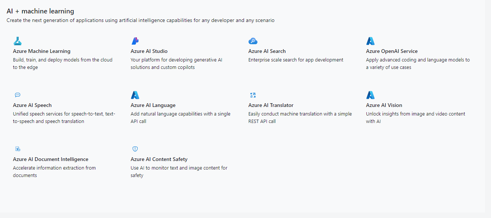

---

<!-- backgroundColor: #000 -->

# Obchodní dům

Přišel za vámi obchodní dům, že chce abyste do jejich aplikace přidali featuru, která bude umožňovat jejich zákazníkům naskenovat účtenku a rozdělit jednoltivé položky mezi více lidí. Jakou službu využijete?

---

<!-- backgroundColor: #F9FAFE -->

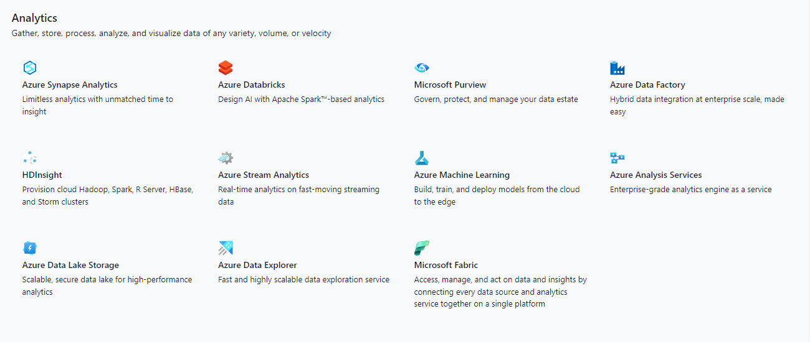

---

<!-- backgroundColor: #000 -->

# Otužilcův deník

Jste vášnivým otužilcem. Chcete si vést pravidelné záznamy o tom, jaká je teplota vody v řece, kam se chodíte každý den otužovat. Bohužel ale ČHMU nemá v daném místě ždnou sondu. Vyrobíte si tedy zařízení, které pomocí LoRa odesílá data na váš server. Vy je chcete ale nějako analyzovat. Jaký produkt byste pro to využili?

---

<!-- backgroundColor: #F9FAFE -->

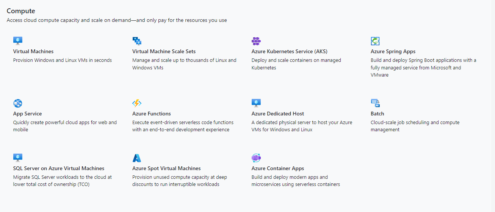

---

<!-- backgroundColor: #000 -->

# Vánoční videopřání

Tvoříte platformu, která umožňuje vašim zákazníkům natáčet videa s využitím rozšířené reality. Funguje tím způsobem, že vás ve videu oblékne do produktu, který zakoupíte a vyexportuje video, které můžete odeslat. Jakou služby byste využili pro hostování takové aplikace?

---

<!-- backgroundColor: #F9FAFE -->

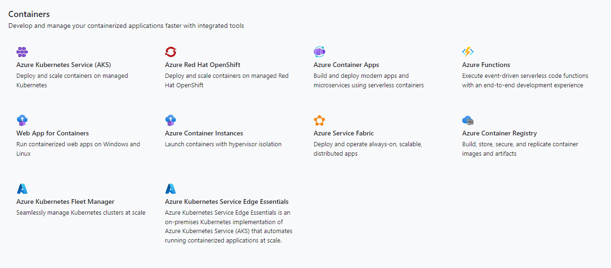

---

<!-- backgroundColor: #000 -->

# Kdykoliv a kdekoliv

Vytváříte wordpress pluginy. Pro vývoj si ale musíte neusátále spuštět lokální server. To je ale strašlivá otrava a to především, když chce s vývojem začít někdo noví a to jak na lokálním severu nebo třeba na nějakém jiném. Jakou službu byste využili? Ideálně aby stačilo naklonovat repostář a spustit commnad, který vše několika způsoby rozjede?

---

<!-- backgroundColor: #F9FAFE -->

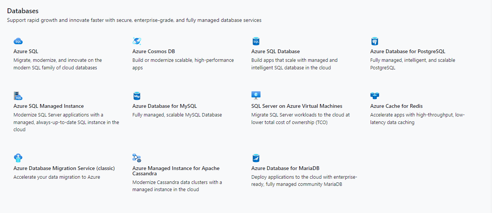

---

<!-- backgroundColor: #000 -->

# Velký počet - není problém

Provozujete službu, která zažívá obrosvký rozmach. Vaše datové analýzy ukazují, že do několika dnů využití vašeho produkutu zažije enormní nárust až od 700%. Na pozadí používáte databázi. Bojíte se, že ale nezvládne obsloužit veliké množství zařízení a jejich dotazů. Jakou službu byste doporučili využít?

---

<!-- backgroundColor: #F9FAFE -->

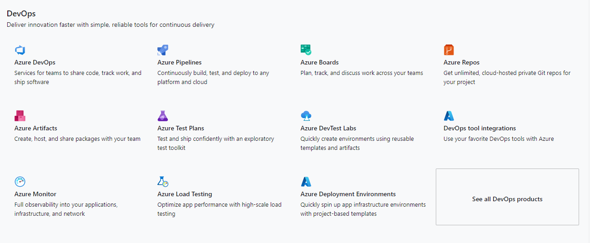

---

<!-- backgroundColor: #000 -->

# Nová infrastruktura za pár minut?

Staráte se o infrastrukturu bance. Chce expandovat do nového regionu. Ten má ale specifika, že musejí všechna data být pouze na serverech v jejich oblati. Musíte tedy vytvořit celou infrastrukutur automatizovaně a co nejdříve. Jaké služby z oblasti DevOps byste využili?

---

<!-- backgroundColor: #F9FAFE -->

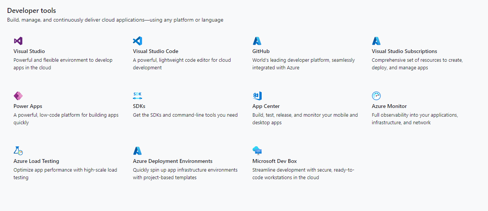

---

<!-- backgroundColor: #000 -->

# Data pro otužilce podruhé

Chodité se pravidelně otužovat. Ve místě kam chodíte má ČHMU stanici. Ta ovšem zobrazuje data pouze za poslední den. Vy si chcete ale ukládat celou historii. Jaký produkt z nabízených nástrojů využijete?

---

<!-- backgroundColor: #F9FAFE -->

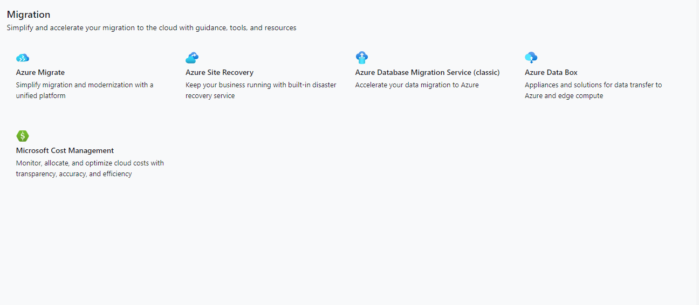

---

<!-- backgroundColor: #F9FAFE -->

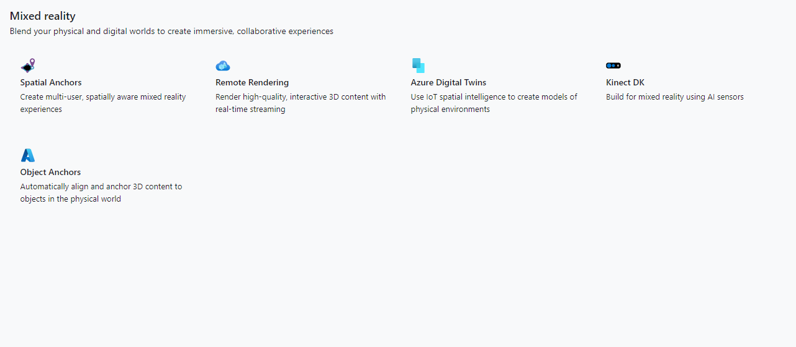

---

<!-- backgroundColor: #F9FAFE -->

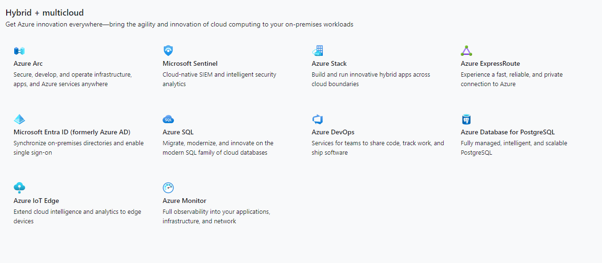

---

<!-- backgroundColor: #000 -->

# Bezpečnost na Univerzitě

Spravujte velkou inverzitní síť. Využíváte jak vlastních výpočetních zdrojů, tak externách cloudových služeb jako Azure, AWS, ... Vyšlo ale nové nařízení od EU a musíte zabezpečit celý váš hybdriní systém. Jaké služby využijtete?

---

<!-- backgroundColor: #F9FAFE -->

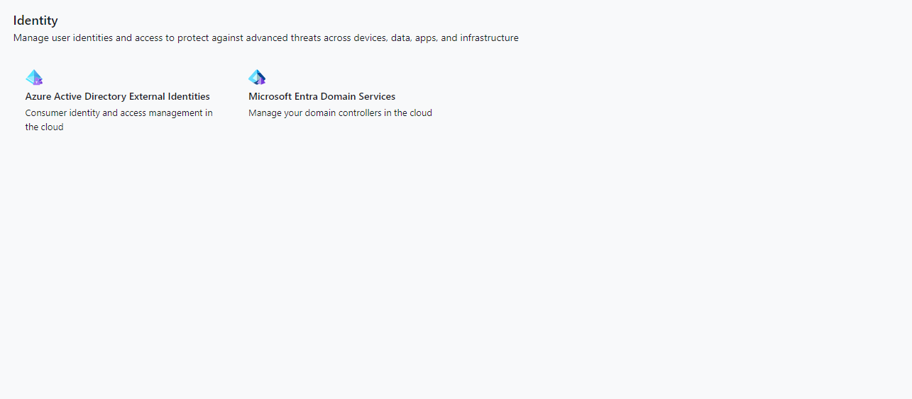

---

<!-- backgroundColor: #F9FAFE -->

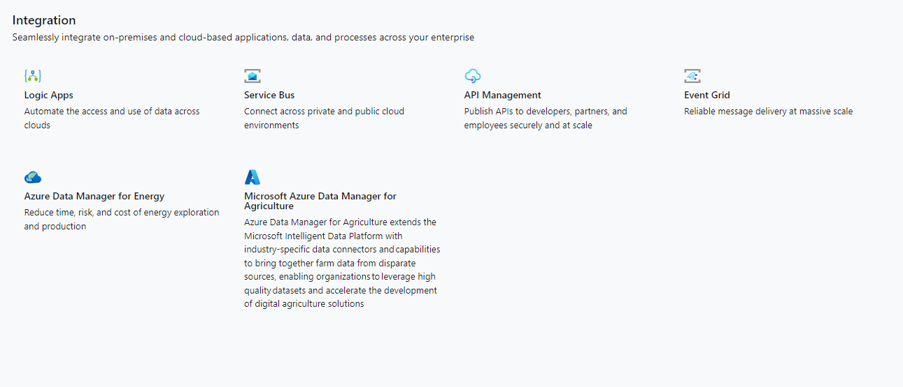

---

<!-- backgroundColor: #000 -->

# Otužilci potřetí

Provozujte obrovskou síť IoT zařízení pro otužilce, které na různých úsecích měří kvalitu vody a teplotu vody. Vlhkost vzduchu a teplotu vzduchu. Data jsou na sondě zpracovávány a odesílány pomocí prokolu MQQT do cloudu. Chybí vám ale určítý aplikační interface, který by zajitil komunikační vrstvu mezi sondou a serverem vytočeným v cloudu. Jakou služby využijete?

---

<!-- backgroundColor: #F9FAFE -->

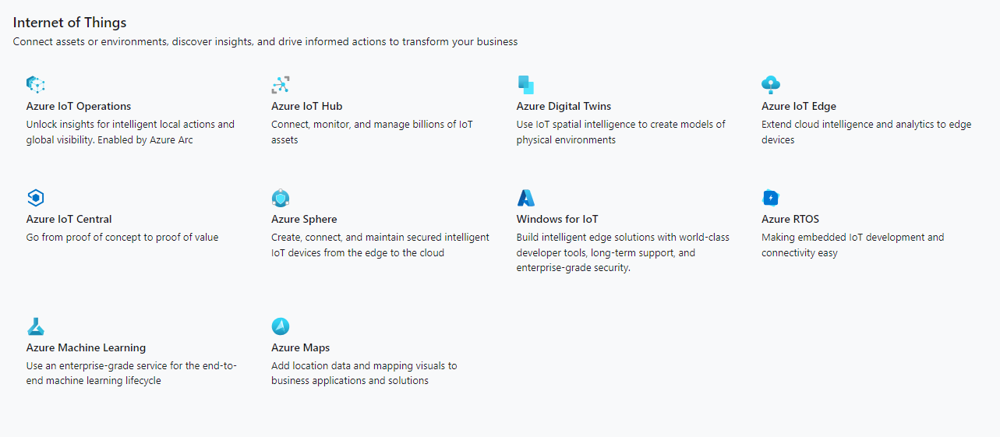

---

<!-- backgroundColor: #000 -->

# Průmysl načas

Jste ředitelem optimalalizace výroby v veliké firmě speciialujzící se na součástky ve sféře automotive. Potřebujte navrhnout linku, která bude splňovat bezpečnostní podmínky a uspokojí vaše potřeby, tedy zrychlení procu výroby. K tomu budete využívat čimu ST32. Jakého řešení využijte k tomu, aby mohla v rálném čase komunikovat mezi sebou i s nadřazenou infrastrukuturou? 

---

<!-- backgroundColor: #F9FAFE -->

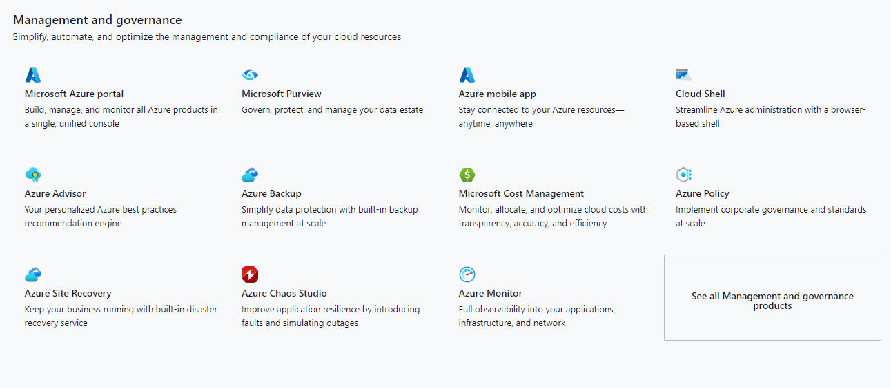

---

<!-- backgroundColor: #F9FAFE -->

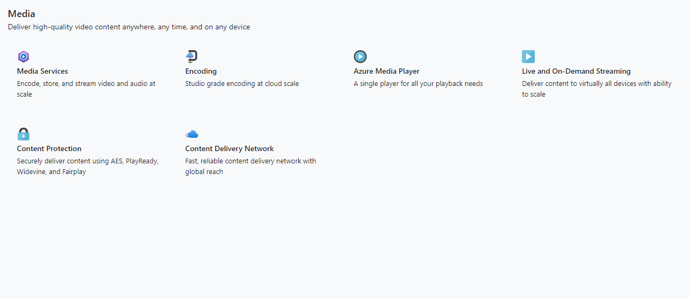

---

<!-- backgroundColor: #F9FAFE -->

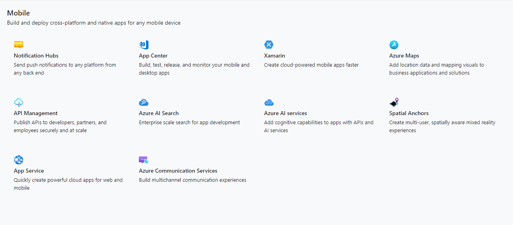

---

<!-- backgroundColor: #000 -->

# Nezapomeň

Vyrábíte online brožuru cílenou na mobilní telfony, která bude fungovat jako PWA s četením na každý den. Chcete umžnit uživatelům, aby nezapomněli na to si každý den čtení přečíst. Jakou službu využijte?

---

<!-- backgroundColor: #F9FAFE -->

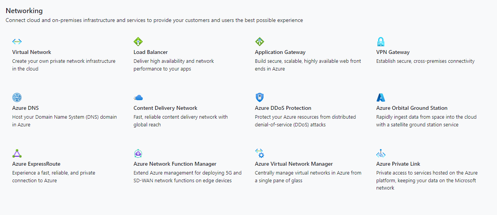

---

<!-- backgroundColor: #000 -->

# Jak voda v přehradě

Vaše služba se rozrostal a musíte zvětšit vaši infrastrukut. Proto jste z jedné instance serveru škálovali na více. S tím ale nastává problém toho, že musíte být schopni požadvky od klinetů rozdělit mezi více instancí tak, abyste je zvládli rovnoměrné odbavovat. Jakou službu zvolíte?

---

<!-- backgroundColor: #F9FAFE -->

---

<!-- backgroundColor: #000 -->

# Automatizace forever

Ve svém automatizovaném procesu pro nasazování aplikací, potřebujte přistupovat k zabezpečeným klíčům. Jakou službu byste pro tento problém zvolili?

---

<!-- backgroundColor: #F9FAFE -->

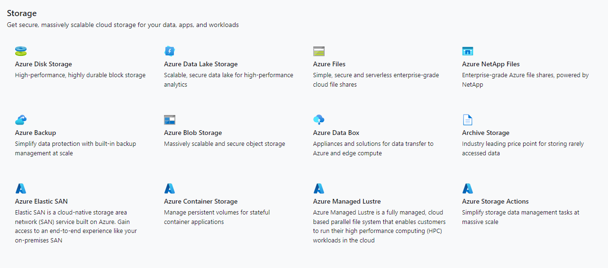

---

<!-- backgroundColor: #000 -->

# Kde jen mám teplate

Vytváříte automatický skript, který má běžet na infrastuktuře u vaši zákazníků. Jeho běh ale vyžaduje stažení *teplate* souboru. Na něho ale máte požadavek takový, že ho chcete být shcopni měnit v čase a všem zákazníkům poskytovat nejnovější verzi aniž byste museli zasahovat do skriptu, který mají u sebe. Zároveň chcete být schpni monitorovat využítí *template* jednotlivými zákazníky. Jaké služby využijete k uložení souboru.

---

<!-- backgroundColor: #F9FAFE -->

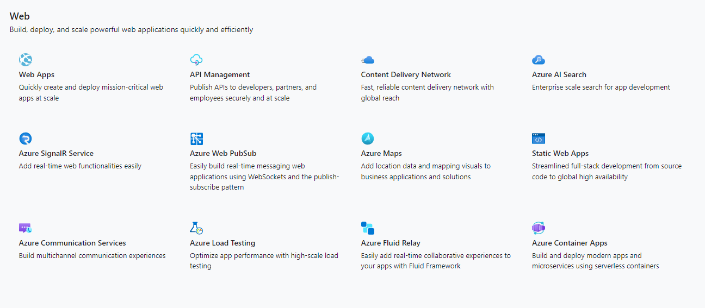

---

<!-- backgroundColor: #000 -->

# Zase je to pomalé

Provozujte webovou aplikaci, kteá je využívaná po celém světe. Vaše servery ovšem po celém světe distribuované nejsou. Vaše aplikace navíc obashuje spoutu statických dat. Jakou službu byste využili pro zrychlení načítání aplikace?

---

<!-- backgroundColor: #F9FAFE -->

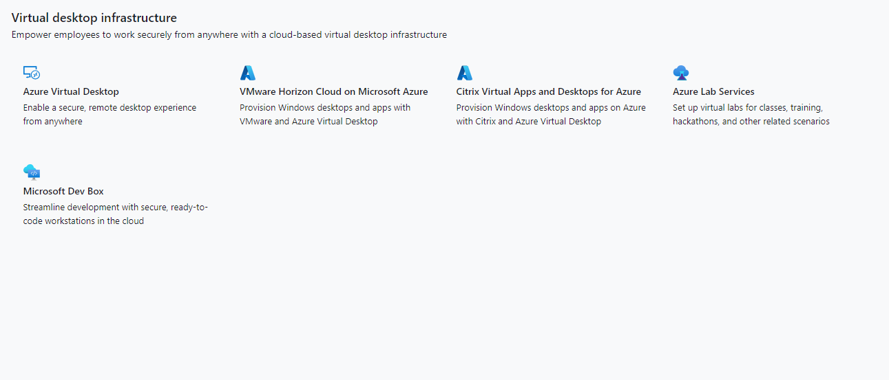

---

<!-- backgroundColor: #000 -->

